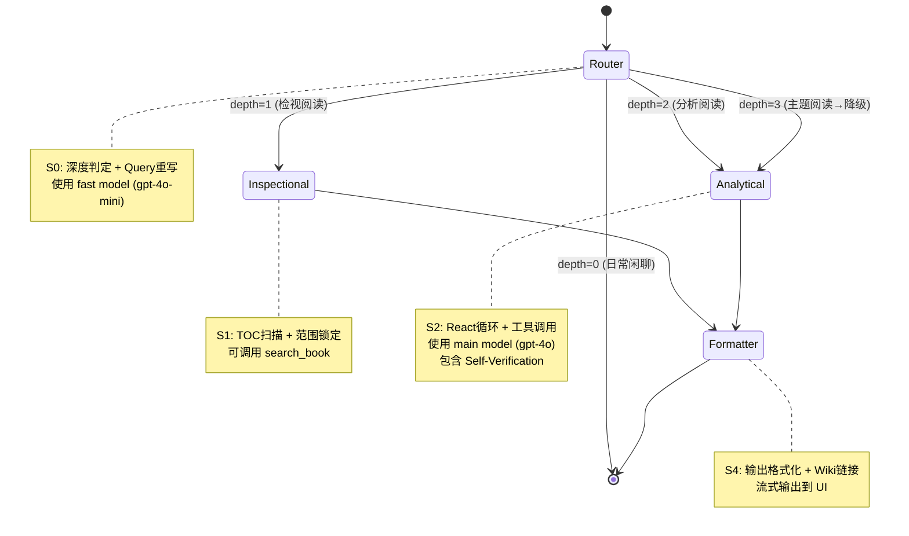

# LangChain + LangGraph Agent 重构设计文档

## 概述

将 DeepReader 的 Cognitive Engine Agent 从自研状态机重构为基于 LangChain.js + LangGraph.js 的标准化架构。

**目标**：
- 标准化架构，便于维护和扩展
- 简化状态管理，使用 LangGraph StateGraph 表达路由逻辑
- 更好的可观测性，集成 LangSmith + LangFuse 双追踪
- 复用 LangChain 生态组件（工具、记忆、模型）

**版本**：LangChain.js 0.3.x + LangGraph.js 0.2.x

---

## 现有架构分析

### Cognitive Engine 状态机

现有状态流程：
```
S0 Router → (depth=0) → S4 Formatter → END
           → (depth=1) → S1 Inspectional → S4 Formatter → END
           → (depth=2) → S2 Analytical → S4 Formatter → END
           → (depth=3) → S2 Analytical (降级) → S4 Formatter → END
```

核心文件：
- `engine.ts` - 主编排器（switch-case 手动路由）
- `states/*.ts` - 状态节点实现
- `run-state-loop.ts` - 状态内 LLM 循环（625 行）

问题：
- 状态机逻辑分散在多个文件
- 工具执行、Loop Detection、Self-Verification 逻辑耦合
- 无法复用 LangChain 生态工具和追踪

### 工具系统

现有实现：
- `BaseTool` 基类（参数验证、类型转换）
- `ToolRegistry` Map 注册表
- 自定义 JSON Schema 格式

问题：
- 不兼容 LangChain Tool 接口
- 无法使用 LangChain 的 `ToolNode`

### LLM 调用

现有实现：
- `llm-client.ts` - 自定义 OpenAI API 调用
- 支持流式响应、工具调用、DeepSeek reasoning

问题：
- 不兼容 LangChain ChatModel 接口
- 无法使用 LangChain 的模型路由和 fallback

---

## LangGraph StateGraph 设计

### 状态定义

```typescript
import { BaseMessage } from '@langchain/core/messages';

interface AgentState {
  // 消息历史（LangChain 格式）
  messages: BaseMessage[];
  
  // 阅读深度（Adler 层次）
  depth: 0 | 1 | 2 | 3;
  
  // 重写后的独立查询
  standaloneQuery: string;
  
  // 范围锁定（章节 node_ids）
  scopeNodeIds?: string[];
  
  // TOC 摘要（S1 输出）
  tocSummary?: string;
  
  // 分析结论（S2 输出）
  analysisResult?: string;
  
  // 工具调用结果（用于 Self-Verification）
  toolResults: Array<{
    toolName: string;
    args: Record<string, unknown>;
    result: string;
    blockIds: string[];
  }>;
  
  // 最终输出
  finalOutput?: string;
  
  // 运行时上下文（必须可序列化）
  indexId: string;
  pdfName: string;
  docDescription?: string;
  markdownFiles?: Record<string, string>;
}

// 注意：Obsidian App 实例和 Vault 不能放入状态
// 它们通过 configurable 在运行时传入
interface RuntimeContext {
  app: App;
  vaultPath: string;
  settings: AgentSettings;
}
```

### 状态图结构

#### 可视化流程图（Mermaid）



#### 代码实现
import { StateGraph, END } from '@langchain/langgraph';

// 创建状态图
const graph = new StateGraph<AgentState>({
  channels: {
    messages: { value: (x: BaseMessage[], y: BaseMessage[]) => x.concat(y) },
    depth: { value: (x, y) => y ?? x },
    standaloneQuery: { value: (x, y) => y ?? x },
    scopeNodeIds: { value: (x, y) => y ?? x },
    toolResults: { value: (x, y) => x.concat(y) },
    finalOutput: { value: (x, y) => y ?? x },
  },
});

// 添加节点
graph.addNode('router', routerNode);
graph.addNode('inspectional', inspectionalNode);
graph.addNode('analytical', analyticalNode);
graph.addNode('formatter', formatterNode);
graph.addNode('tools', toolNode); // LangGraph ToolNode

// 添加边
graph.addEdge(START, 'router');
graph.addConditionalEdges('router', routeByDepth, {
  0: END,
  1: 'inspectional',
  2: 'analytical',
  3: 'analytical',
});
graph.addEdge('inspectional', 'formatter');
graph.addEdge('analytical', 'formatter');
graph.addEdge('formatter', END);

// 条件路由函数
function routeByDepth(state: AgentState): string {
  return String(state.depth);
}
```

### 节点实现示例

```typescript
// Router Node (S0)
async function routerNode(state: AgentState): Promise<Partial<AgentState>> {
  const model = getFastModel();
  const prompt = ChatPromptTemplate.fromTemplate(ROUTER_PROMPT);
  
  const chain = prompt.pipe(model);
  const response = await chain.invoke({
    query: state.messages[state.messages.length - 1].content,
    pdfName: state.pdfName,
  });
  
  // 解析深度
  const parsed = parseRouterOutput(response.content);
  
  return {
    depth: parsed.depth,
    standaloneQuery: parsed.standalone_query,
    messages: [response],
  };
}

// Analytical Node (S2) - 带工具调用
async function analyticalNode(state: AgentState): Promise<Partial<AgentState>> {
  const model = getMainModel().bindTools(tools);
  const prompt = ChatPromptTemplate.fromTemplate(ANALYTICAL_PROMPT);
  
  // 使用 LangGraph 的 prebuilt react pattern
  const reactAgent = createReactAgent({
    llm: model,
    tools: tools,
    stateModifier: (state) => ({
      ...state,
      scopeNodeIds: state.scopeNodeIds, // 范围拦截
    }),
  });
  
  const result = await reactAgent.invoke(state);
  
  return {
    analysisResult: result.messages[result.messages.length - 1].content,
    toolResults: extractToolResults(result),
    messages: result.messages,
  };
}
```

---

## 错误处理设计

### 错误分类

参考现有 `IndexError` 设计，定义 LangChain 适配的错误类：

```typescript
// 基础错误类
class AgentError extends Error {
  code: string;
  recoverable: boolean;
  userMessage: string;
  
  constructor(code: string, message: string, userMessage: string, recoverable: boolean = true) {
    super(message);
    this.code = code;
    this.userMessage = userMessage;
    this.recoverable = recoverable;
  }
}

// 具体错误类型
class NodeTimeoutError extends AgentError {
  constructor(nodeName: string, timeout: number) {
    super(
      'NODE_TIMEOUT',
      `Node ${nodeName} timed out after ${timeout}ms`,
      `操作超时，请稍后重试或简化问题`,
      true
    );
  }
}

class ToolExecutionError extends AgentError {
  constructor(toolName: string, error: Error) {
    super(
      'TOOL_ERROR',
      `Tool ${toolName} failed: ${error.message}`,
      `工具执行失败，尝试其他方式`,
      true
    );
  }
}

class LLMError extends AgentError {
  constructor(provider: string, error: Error) {
    super(
      'LLM_ERROR',
      `LLM ${provider} error: ${error.message}`,
      `AI 服务暂时不可用，请检查网络或稍后重试`,
      true
    );
  }
}

class StateSerializationError extends AgentError {
  constructor(field: string) {
    super(
      'SERIALIZATION_ERROR',
      `State field ${field} is not serializable`,
      `内部状态错误，请联系开发者`,
      false
    );
  }
}
```

### 节点错误处理策略

```typescript
// 节点包装器（统一错误处理）
async function safeNodeExecute(
  nodeName: string,
  fn: () => Promise<Partial<AgentState>>,
  options: { timeout: number; retries: number }
): Promise<Partial<AgentState>> {
  try {
    return await withRetry(
      () => withTimeout(fn(), options.timeout, nodeName),
      options.retries,
      1000
    );
  } catch (error) {
    if (error instanceof NodeTimeoutError) {
      // 超时：记录并返回降级结果
      console.error(`[${nodeName}] Timeout after ${options.timeout}ms`);
      return { finalOutput: '操作超时，请稍后重试' };
    }
    
    if (error instanceof LLMError) {
      // LLM 错误：尝试 fallback 模型
      console.error(`[${nodeName}] LLM error, trying fallback`);
      // 可切换到备用模型重试
    }
    
    // 其他错误：抛出给上层
    throw new AgentError(
      'NODE_ERROR',
      error instanceof Error ? error.message : String(error),
      '处理过程中发生错误'
    );
  }
}

// 节点配置
const nodeConfigs = {
  router: { timeout: 30000, retries: 1 },
  inspectional: { timeout: 60000, retries: 2 },
  analytical: { timeout: 120000, retries: 2 },
  formatter: { timeout: 200000, retries: 1 },
};
```

### 用户友好错误消息

| 错误代码 | 用户消息 | 恢复建议 |
|----------|----------|----------|
| NODE_TIMEOUT | 操作超时，请稍后重试 | 简化问题或减少查询范围 |
| TOOL_ERROR | 工具执行失败 | 检查文档是否已索引 |
| LLM_ERROR | AI 服务暂时不可用 | 检查 API Key 和网络 |
| SERIALIZATION_ERROR | 内部状态错误 | 刷新插件或重启 Obsidian |

---

## 工具系统重构

### StructuredTool 定义

```typescript
import { DynamicStructuredTool } from '@langchain/core/tools';
import { z } from 'zod';

// Search Book Tool
const searchBookTool = new DynamicStructuredTool({
  name: 'search_book',
  description: '搜索书籍内容，返回相关段落和 block_id',
  schema: z.object({
    query: z.string().describe('搜索关键词'),
    top_k: z.number().optional().default(5).describe('返回结果数量'),
    scope_node_ids: z.array(z.string()).optional()
      .describe('范围锁定，只在这些章节内搜索'),
  }),
  func: async ({ query, top_k, scope_node_ids }) => {
    // Obsidian 本地搜索逻辑
    const results = await localSearch(query, top_k, scope_node_ids);
    return formatSearchResults(results);
  },
});

// Read Section Tool
const readSectionTool = new DynamicStructuredTool({
  name: 'read_book_section',
  description: '精读指定章节内容',
  schema: z.object({
    node_ids: z.array(z.string()).describe('章节 node_id 列表'),
    focus: z.string().optional().describe('关注焦点'),
  }),
  func: async ({ node_ids, focus }) => {
    const content = await readSections(node_ids, focus);
    return content;
  },
});

// Write Note Tool
const writeNoteTool = new DynamicStructuredTool({
  name: 'write_note',
  description: '将分析结果写入 Obsidian 笔记',
  schema: z.object({
    title: z.string().describe('笔记标题'),
    content: z.string().describe('笔记内容'),
    folder: z.string().optional().default('DeepReader/Notes'),
  }),
  func: async ({ title, content, folder }, runManager) => {
    // 通过 runManager 记录追踪
    const path = `${folder}/${title}.md`;
    await app.vault.create(path, content);
    return `笔记已写入: ${path}`;
  },
});

// 工具列表
const tools = [
  searchBookTool,
  readSectionTool,
  writeNoteTool,
  addMemoryTool,
  searchMemoryTool,
  updateProfileTool,
  searchReadBooksTool,
];
```

### ToolNode 集成

```typescript
import { ToolNode } from '@langchain/langgraph/prebuilt';

const toolNode = new ToolNode(tools);

// 在 Analytical Node 中使用
graph.addNode('tools', toolNode);
graph.addConditionalEdges('agent', shouldContinue, {
  continue: 'tools',
  end: 'formatter',
});
graph.addEdge('tools', 'agent');
```

---

## LLM 调用层

### ChatModel 配置

```typescript
import { ChatOpenAI } from '@langchain/openai';

// 模型工厂
function createChatModel(config: {
  model: string;
  apiKey: string;
  baseUrl?: string;
  streaming?: boolean;
}): ChatOpenAI {
  return new ChatOpenAI({
    modelName: config.model,
    openAIApiKey: config.apiKey,
    configuration: {
      baseURL: config.baseUrl || 'https://api.openai.com/v1',
    },
    streaming: config.streaming ?? true,
    maxRetries: 2,
    timeout: 60000,
  });
}

// 快速模型（S0 Router）
function getFastModel(): ChatOpenAI {
  return createChatModel({
    model: 'gpt-4o-mini',
    apiKey: settings.openaiApiKey,
  });
}

// 主模型（S1/S2）
function getMainModel(): ChatOpenAI {
  return createChatModel({
    model: settings.llmModel || 'gpt-4o',
    apiKey: settings.openaiApiKey,
  });
}

// Reasoning 模型（DeepSeek）
function getReasoningModel(): ChatOpenAI {
  return createChatModel({
    model: 'deepseek-reasoner',
    apiKey: settings.deepseekApiKey,
    baseUrl: 'https://api.deepseek.com/v1',
  });
}
```

### 流式调用

```typescript
const model = getMainModel();
const stream = await model.stream(messages);

for await (const chunk of stream) {
  callbacks.onContent(chunk.content);
}
```

---

## Memory 系统（混合策略）

### LangChain Memory 层

```typescript
import { BufferMemory } from 'langchain/memory';
import { MemorySaver } from '@langchain/langgraph';

// 对话历史（短期）
const conversationMemory = new BufferMemory({
  memoryKey: 'chat_history',
  returnMessages: true,
});

// LangGraph Checkpointer（状态持久化）
const memorySaver = new MemorySaver();

const graph = new StateGraph<AgentState>(...)
  .compile({
    checkpointer: memorySaver,
  });

// 恢复会话
const result = await graph.invoke(input, {
  configurable: { thread_id: sessionId },
});
```

### Obsidian 存储后端

```typescript
class ObsidianMemoryBackend {
  private vault: Vault;
  
  async save(key: string, value: string): Promise<void> {
    const file = this.vault.getAbstractFileByPath('MEMORY.md');
    await this.vault.append(file, `\n## ${key}\n${value}`);
  }
  
  async load(key: string): Promise<string | null> {
    const file = this.vault.getAbstractFileByPath('MEMORY.md');
    const content = await this.vault.read(file);
    // 解析并返回
  }
  
  async search(query: string): Promise<string[]> {
    // 使用 PageIndex 搜索 MEMORY.md
  }
}
```

---

## Tracing（双追踪）

### LangSmith 配置

```typescript
import { LangChainTracer } from '@langchain/core/tracers/langchain';

// 环境变量配置
// LANGCHAIN_API_KEY=...
// LANGCHAIN_ENDPOINT=https://api.smith.langchain.com
// LANGCHAIN_TRACING_V2=true

const tracer = new LangChainTracer({
  projectName: 'deepreader-agent',
});
```

### LangFuse 配置

```typescript
import { LangfuseCallbackHandler } from '@langfuse/langchain';

const langfuseHandler = new LangfuseCallbackHandler({
  publicKey: settings.langfusePublicKey,
  secretKey: settings.langfuseSecretKey,
  baseUrl: settings.langfuseBaseUrl,
});
```

### 双追踪集成

```typescript
const callbacks = [tracer, langfuseHandler];

await model.invoke(messages, { callbacks });
await graph.invoke(state, { callbacks });
```

---

## 目录结构

```
src/agent/
├── graph/                     # LangGraph 状态图
│   ├── state.ts               # AgentState 定义
│   ├── nodes/
│   │   ├── router-node.ts     # S0 Router
│   │   ├── inspectional-node.ts # S1 Inspectional
│   │   ├── analytical-node.ts # S2 Analytical
│   │   ├── formatter-node.ts  # S4 Formatter
│   │   └── tool-node.ts       # ToolNode wrapper
│   ├── edges.ts               # 条件边定义
│   ├── graph.ts               # StateGraph 编译
│   └── checkpoints.ts         # MemorySaver 配置
│
├── tools/                     # LangChain StructuredTool
│   ├── search-book.ts
│   ├── read-section.ts
│   ├── write-note.ts
│   ├── memory-tools.ts
│   ├── profile-tools.ts
│   ├── cross-book-tools.ts
│   └── index.ts               # 工具注册
│
├── models/                    # ChatModel 配置
│   ├── config.ts              # 模型选择逻辑
│   ├── fast-model.ts          # gpt-4o-mini
│   ├── main-model.ts          # gpt-4o / 用户设置
│   ├── reasoning-model.ts     # DeepSeek 支持
│   └── index.ts               # 模型工厂
│
├── memory/                    # 混合记忆系统
│   ├── langchain-memory.ts    # BufferMemory + Checkpointer
│   ├── obsidian-memory.ts     # Obsidian 存储
│   ├── retriever.ts           # 向量检索
│   └── index.ts               # Memory 组合
│
├── tracing/                   # 双追踪系统
│   ├── langsmith.ts           # LangSmith 配置
│   ├── langfuse.ts            # LangFuse 配置
│   ├── callbacks.ts           # Callbacks 合并
│   └── index.ts               # 追踪入口
│
├── prompts/                   # LangChain PromptTemplate
│   ├── router-prompt.ts       # ChatPromptTemplate
│   ├── inspectional-prompt.ts
│   ├── analytical-prompt.ts
│   ├── formatter-prompt.ts
│   └── index.ts               # 提示模板注册
│
├── context/                   # 上下文管理（保持）
│   └── builder.ts             # ContextBuilder
│
├── index.ts                   # Agent 入口
├── types.ts                   # 类型定义
└── errors.ts                  # 错误类
```

---

## 迁移计划

### Phase 1: 基础设施（1-2 周）

**目标**：搭建 LangChain/LangGraph 基础框架

**任务**：
1. 创建新分支 `feature/langchain-refactor`
2. 安装依赖
   ```bash
   npm install @langchain/core @langchain/langgraph @langchain/openai zod
   npm install @langfuse/langchain
   ```
3. 创建 `graph/` 目录结构
4. 实现 `AgentState` 状态定义
5. 配置 LangSmith + LangFuse 双追踪
6. 编写基础设施测试

**验收标准**：
- `AgentState` 类型定义完成
- 双追踪可正常记录测试调用

### Phase 2: 工具系统重构（2-3 周）

**目标**：将现有工具转换为 LangChain StructuredTool

**现有工具对照表**：

| 现有工具 | 新工具名称 | 功能保持 | 变化点 |
|----------|------------|----------|--------|
| `search_book` | `SearchBookTool` | ✅ | Zod schema，DynamicStructuredTool |
| `read_book_section` | `ReadSectionTool` | ✅ | Zod schema，runManager 回调 |
| `write_note` | `WriteNoteTool` | ✅ | Zod schema，app 通过 configurable |
| `add_memory` | `AddMemoryTool` | ✅ | Zod schema |
| `search_memory` | `SearchMemoryTool` | ✅ | Zod schema |
| `update_profile` | `UpdateProfileTool` | ✅ | Zod schema |
| `search_read_books` | `SearchReadBooksTool` | ✅ | Zod schema |
| `canvas` | `CanvasTool` | ✅ | Zod schema，app 通过 configurable |
| `excalidraw` | `ExcalidrawTool` | ✅ | Zod schema |

**任务**：
1. 重写核心工具
   - `search_book` → `SearchBookTool`
   - `read_book_section` → `ReadSectionTool`
   - `write_note` → `WriteNoteTool`
2. 重写辅助工具
   - `add_memory` / `search_memory` → MemoryTools
   - `update_profile` → ProfileTool
   - `search_read_books` → CrossBookTool
3. 实现 `ToolNode` wrapper
4. 编写工具单元测试
5. 保持工具功能不变，仅改变接口

**验收标准**：
- 所有工具转换为 `DynamicStructuredTool`
- 工具测试覆盖率 > 80%
- 功能与现有工具一致

### Phase 3: 状态节点迁移（3-4 周）

**目标**：实现 LangGraph StateGraph

**任务**：
1. 实现 RouterNode（S0）
   - 深度判定逻辑
   - Query 重写
2. 实现 InspectionalNode（S1）
   - TOC 扫描
   - 范围锁定
3. 实现 AnalyticalNode（S2）
   - React pattern
   - 工具调用循环
   - Self-Verification
4. 实现 FormatterNode（S4）
   - 输出格式化
   - Wiki 链接生成
5. 实现条件边路由
6. 编译 StateGraph
7. 编写节点测试

**验收标准**：
- StateGraph 可正常执行完整流程
- 节点测试覆盖核心逻辑
- 输出格式与现有系统一致

### Phase 4: Memory 和 Checkpointing（1-2 周）

**目标**：实现混合记忆系统

**任务**：
1. 实现 LangChain BufferMemory
2. 配置 MemorySaver checkpointer
3. 实现 ObsidianMemoryBackend
4. 集成两层记忆
5. 测试状态恢复

**验收标准**：
- 会话状态可通过 thread_id 恢复
- MEMORY.md 正常写入和读取

### Phase 5: 集成测试和优化（1-2 周）

**目标**：确保重构后功能完整

**任务**：
1. E2E 测试完整流程
2. 性能对比测试（新旧版本）
3. 回归测试现有功能
4. 修复发现的问题
5. 更新文档
   - `CLAUDE.md`
   - `README.md`
   - `CHANGELOG.md`

**性能基准指标**：

| 指标 | 现有版本基准 | 新版本目标 | 测试方法 |
|------|-------------|------------|----------|
| S0 Router 响应时间 | ~1.5s | ≤1.6s (+10%) | 单元测试计时 |
| S2 Analytical 工具循环 | ~15s (5轮) | ≤16.5s (+10%) | E2E 测试计时 |
| 工具执行延迟 | ~500ms/次 | ≤550ms (+10%) | 工具测试计时 |
| 内存占用峰值 | ~50MB | ≤55MB (+10%) | Node 内存监控 |
| 流式输出首字节时间 | ~1s | ≤1.1s (+10%) | UI 测试计时 |

**验收标准**：
- 所有 E2E 测试通过
- 性能指标达到基准目标
- 文档更新完成

---

## 回滚计划

### 分支策略

```
main
  └── feature/langchain-refactor
        ├── phase-1-complete (tag)
        ├── phase-2-complete (tag)
        ├── phase-3-complete (tag)
        ├── phase-4-complete (tag)
        └── phase-5-complete (tag)
```

### 回滚触发条件

| Phase | 回滚条件 | 回滚目标 |
|-------|----------|----------|
| Phase 1 | 基础设施测试失败 > 30% | 回到 main |
| Phase 2 | 工具功能测试失败 > 20% | 回到 phase-1-complete |
| Phase 3 | 状态图 E2E 测试失败 > 15% | 回到 phase-2-complete |
| Phase 4 | Memory 恢复测试失败 | 回到 phase-3-complete |
| Phase 5 | 性能指标未达标 > 2项 | 回到 phase-4-complete |

### 回滚操作

```bash
# 回滚到指定 Phase
git checkout phase-X-complete
git checkout -b feature/langchain-refactor-rollback

# 或直接合并回 main（放弃重构）
git checkout main
git merge --abort  # 如果正在合并
```

### 保留旧代码策略

- 在 `feature/langchain-refactor` 分支开发
- 不删除 `cognitive-engine/` 目录，直到 Phase 5 验收通过
- 每个完成 Phase 创建 git tag
- Phase 5 验收通过后才删除旧代码

---

## 依赖清单

```json
{
  "dependencies": {
    "@langchain/core": "^0.3.x",
    "@langchain/langgraph": "^0.2.x",
    "@langchain/openai": "^0.3.x",
    "@langfuse/langchain": "^3.x",
    "zod": "^3.x"
  }
}
```

---

## 风险和缓解

| 风险 | 影响 | 缓解措施 |
|------|------|----------|
| LangChain.js 与 Obsidian 环境兼容性问题 | 高 | 提前测试 esbuild 打包，确保无 Node.js 原生依赖 |
| 工具执行延迟增加 | 中 | 使用 LangGraph 并行执行，保持现有超时策略 |
| 状态图调试困难 | 中 | LangSmith 可视化追踪，添加详细日志 |
| 迁移期间功能中断 | 高 | 在新分支开发，保持主分支稳定 |
| LangChain 版本更新导致 API 变化 | 中 | 锁定版本号，关注官方 changelog |

---

## 成功标准

1. **功能完整性**：所有现有功能正常工作
2. **性能达标**：响应时间不超过现有版本 10%
3. **可观测性**：LangSmith/LangFuse 可追踪完整执行流程
4. **代码质量**：测试覆盖率 > 80%
5. **文档完善**：迁移文档和架构图更新完成