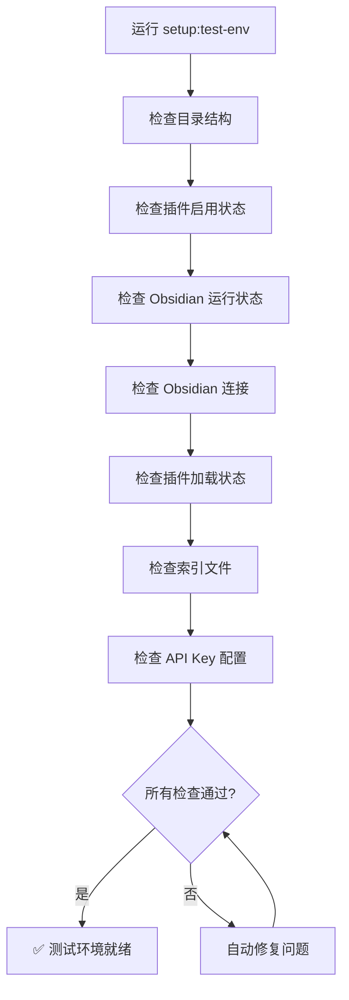

# 测试环境配置 (macOS)

## 一、环境依赖

| 依赖项 | 冒烟测试 (L2) | 轻量 E2E (L3) | 检查方式 |
|--------|---------------|---------------|----------|
| Obsidian 已运行 | ✅ 必需 | ✅ 必需 | `pgrep -x "Obsidian"` |
| 插件已加载 | ✅ 必需 | ✅ 必需 | `evalObsidian()` |
| 索引文件完整 | ❌ 不检查 | ✅ 必需 | `evalObsidian()` |
| API Key 已配置 | ❌ 不检查 | ✅ 必需 | `evalObsidian()` |

## 二、一键配置

```bash
# 完整配置（自动修复所有问题）
npm run setup:test-env

# 仅检查（不修复，报告问题）
npm run setup:test-env:check
```

### 配置流程



### 自动修复项

| 问题 | 自动修复方式 |
|------|-------------|
| 目录不存在 | `mkdir -p` 创建 |
| 插件未启用 | 修改 `community-plugins.json` |
| Obsidian 未运行 | `open -a Obsidian.app` 启动 |
| Obsidian 连接失败 | 等待启动完成 |
| 插件未加载 | 重启插件 |
| 索引文件缺失 | 触发重新索引 |
| API Key 未配置 | 从环境变量读取并配置 |

## 三、多 vault 支持

### 问题描述

当 Obsidian 同时运行多个 vault 时，CLI 会默认连接最近打开的 vault，导致测试无法连接到 test-vault。

### 解决方案

Obsidian CLI 现在会指定 `vault=test-vault` 参数，确保即使有多个实例也能正确连接。

### 配置方法

```bash
# 使用默认 vault (test-vault)
npm run smoke:core

# 指定其他 vault
TARGET_VAULT=my-vault npm run smoke:core
```

### 代码实现

在 `scripts/smoke/lib/obsidian-cli.mjs` 中：

```javascript
/** 目标 vault 名称（支持多 vault 场景） */
const TARGET_VAULT = process.env.TARGET_VAULT || 'test-vault';

export async function exec(subcommand, args = [], { timeout, vault } = {}) {
  const vaultArgs = vault ? [`vault=${vault}`] : [];
  // 使用 vaultArgs 执行命令
}

export async function evalObsidian(expression, { timeout, vault } = {}) {
  // 自动使用 TARGET_VAULT 参数
  const r = await exec('dev:cdp', [...], { timeout, vault: vault || TARGET_VAULT });
}
```

## 四、手动配置（如果自动修复失败）

### 4.1 启动 Obsidian

```bash
open -a "/Applications/Obsidian.app" "/Users/lizhao/workspace/DeepReader/test-vault"
```

### 4.2 启用插件

编辑 `test-vault/.obsidian/community-plugins.json`：

```json
[
  "obsidian-excalidraw-plugin",
  "cmdr",
  "deepreader-dev"
]
```

### 4.3 配置 API Key

1. 打开 Obsidian → 设置 → 第三方插件 → DeepReader
2. 在 API Key 配置项中填入：
   - `DEEPSEEK_API_KEY`（推荐）
   - 或 `OPENAI_API_KEY`

### 4.4 触发索引

在 Obsidian 中打开任意 PDF/EPUB 文件，插件会自动触发索引。

## 五、验证环境

```bash
# 检查环境状态
npm run setup:test-env:check

# 运行冒烟测试
npm run smoke:core

# 运行轻量 E2E
npm run e2e-light
```

## 六、常见问题

### 问题 1: Obsidian 未连接

**现象**：
```
✗ Obsidian 连接失败
```

**解决方案**：
1. 确保 Obsidian 已启动
2. 确保 test-vault 已加载
3. 等待几秒后重试

### 问题 2: 插件未加载

**现象**：
```
✗ 插件未加载
```

**解决方案**：
1. 在 Obsidian 设置中禁用并重新启用 DeepReader
2. 或重启 Obsidian

### 问题 3: 索引文件缺失

**现象**：
```
⚠ catalog.json 不存在
```

**解决方案**：
1. 在 Obsidian 中打开任意 PDF/EPUB 文件
2. 等待索引完成

### 问题 4: API Key 未配置

**现象**：
```
⚠ 未配置 API Key（Agent 功能可能受限）
```

**解决方案**：
```bash
# 设置环境变量
export DEEPSEEK_API_KEY="your-api-key-here"

# 重新运行配置
npm run setup:test-env
```

### 问题 5: 多 vault 场景连接错误

**现象**：
```
插件未加载
catalog.json 不存在
```

**解决方案**：
1. 检查是否有多个 Obsidian 实例运行
2. 使用 `TARGET_VAULT` 环境变量指定正确的 vault
3. 或关闭其他 vault 的 Obsidian 实例

## 七、测试命令参考

```bash
# 单元测试（不需要 Obsidian）
npm run test:run

# 冒烟测试（需要 Obsidian 运行）
npm run smoke:core

# 轻量 E2E（需要 Obsidian 运行 + 索引完整）
npm run e2e-light

# WebdriverIO（自动启动 Obsidian）
npx wdio run tests/wdio.conf.ts
```

## 八、环境变量

```bash
# API Key（用于 Agent 功能测试）
export DEEPSEEK_API_KEY="your-deepseek-api-key"
export OPENAI_API_KEY="your-openai-api-key"

# 目标 vault（用于多 vault 场景）
export TARGET_VAULT="test-vault"

# 可选：Obsidian CLI 路径
export OBSIDIAN_CLI="/Applications/Obsidian.app/Contents/MacOS/obsidian"
```

## 九、效果

| 维度 | 优化前 | 优化后 |
|------|--------|--------|
| 首次配置时间 | 10-15 分钟（手动） | 1-2 分钟（自动） |
| 日常开发配置 | 2-3 分钟 | 0（自动检查） |
| 环境问题排查 | 需要手动检查 | 自动修复 + 报告 |
| 测试执行 | 需要先确认环境 | 直接运行 |
| 多 vault 场景 | ❌ 连接错误 vault | ✅ 正确连接 test-vault |
